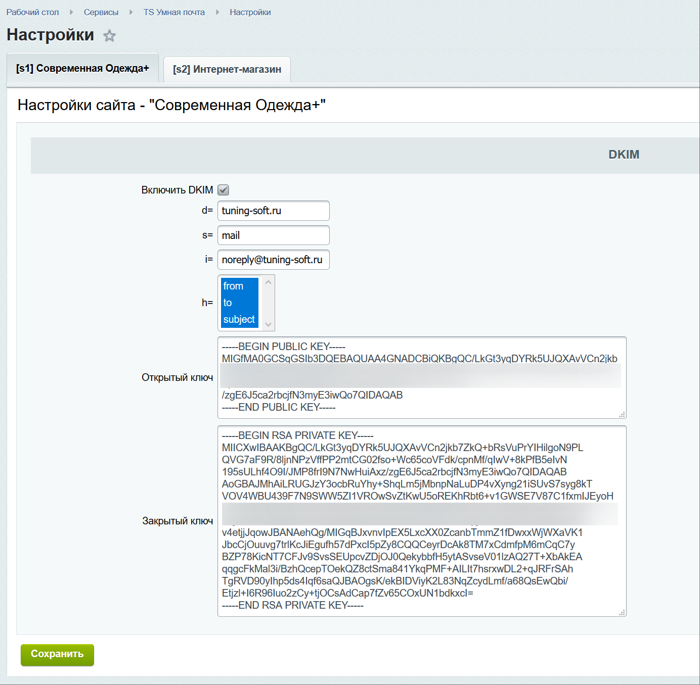
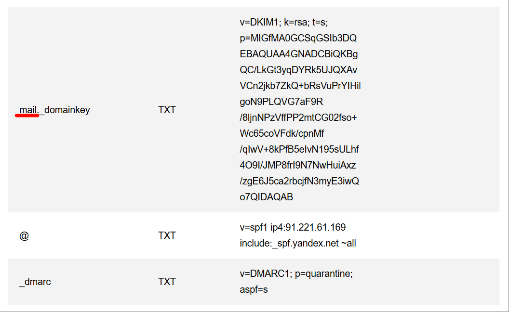
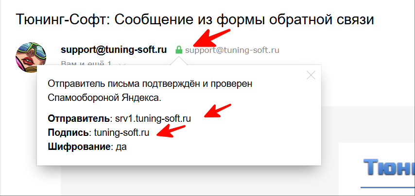
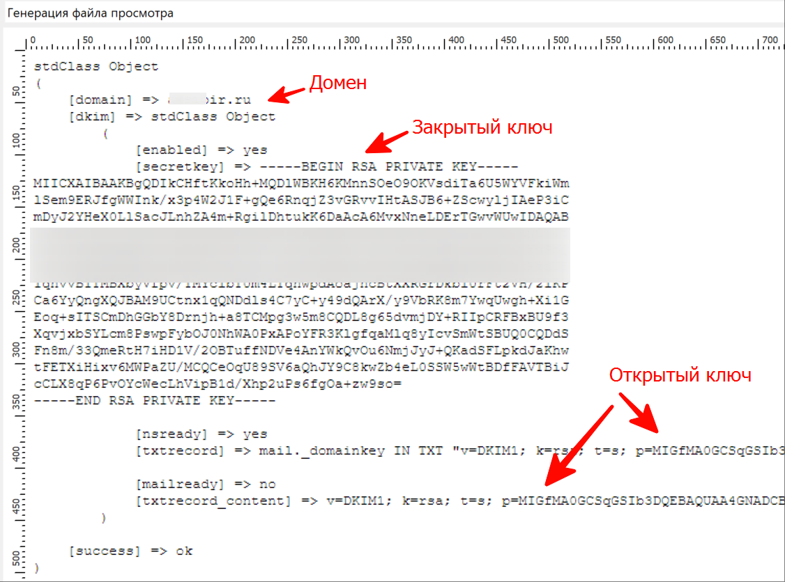
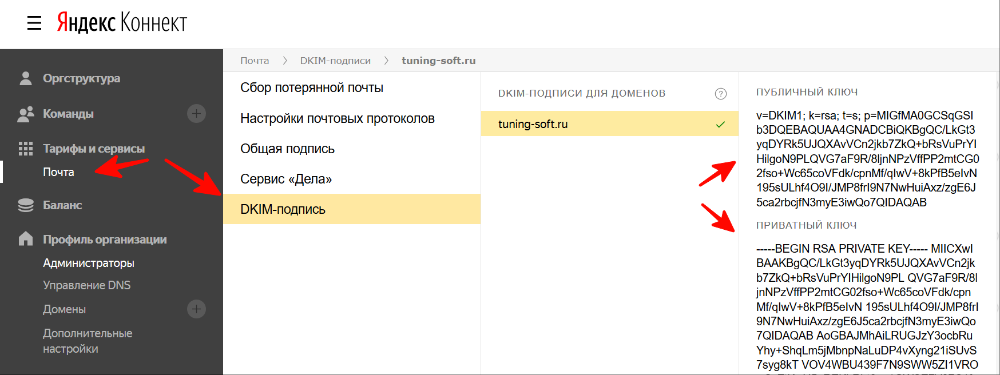
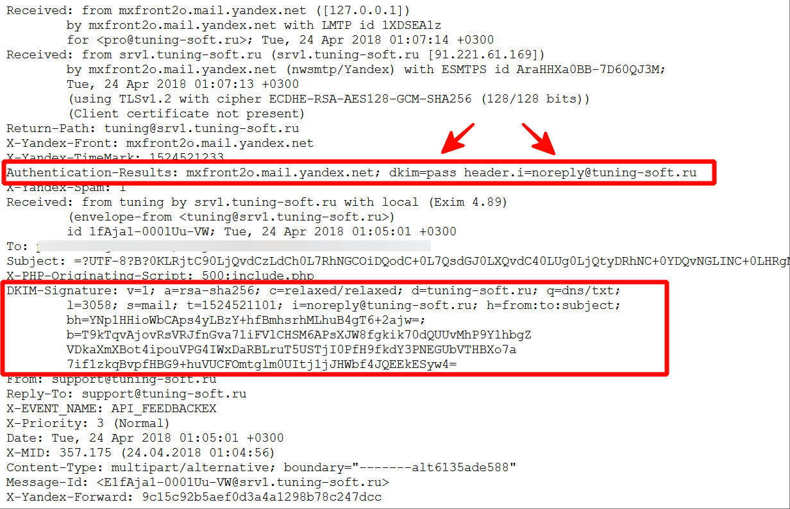
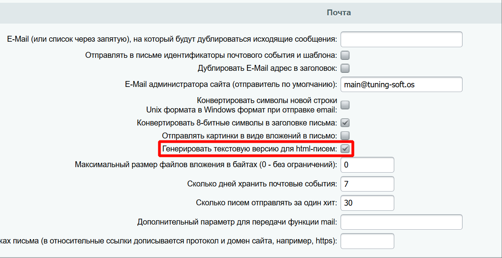
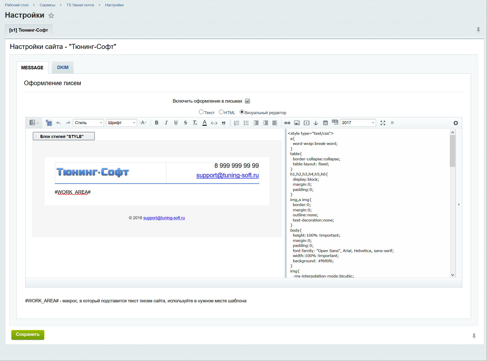

# api.mail
## TS Умная почта (api.mail)
   Модуль для работы с почтой в 1С-Битрикс, подписывает исходящие письма сайта с помощью DKIM заголовка / ключа / подписи, чтобы пользователи получали письма в папку Входящие, а не в Спам.
   
   Оформите все исходящие письма сайта в едином стиле
   В модуле есть возможность оформить свой, универсальный для всех писем сайта, HTML-шаблон письма с применением CSS-оформления без каких-либо ограничений в максимально удобном виде.
   
   По умолчанию есть одна встроенная тема, но вы можете добавить и использовать любую свою тему.
   
   Подпишите все исходящие письма сайта DKIM-подписью
   DKIM (DomainKeys Identified Mail) - технология подтверждения почтового домена отправителя с помощью добавления зашифрованной подписи в заголовки исходящих писем сайта.
   
   Модуль использует функцию custom_mail(), если она у вас уже определена и используется, то письма не будут подписываться DKIM-заголовком, т.к. две одинаковых функции работать одновременно не смогут.
   
   Модуль особенно подходит тем, кто пользуется, например, Яндекс.Почтой для домена.
   Письма из интерфейса Яндекс.Почты подписываются, а письма с сайта рассылает уже другой сервер, который необходимо настраивать отдельно, данный модуль может помочь добиться вот такого идеального результата.
   
   100% гарантии нет, что это поможет, помимо DKIM-заголовка нужно делать еще ряд настроек в DNS-записях домена, на стороне веб-сайта и веб-сервера.
   Например, почта Gmail все равно будет отправлять письма в папку Спам, если получит некорректный EHLO, хоть какие заголовки в письмах подставляй.
   Настройка почты на сервере не простая задача, иногда в силу ряда проблем даже не выполнимая.
   
   
   
   
   
   
    
      
      
      